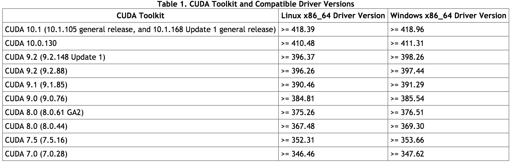

# cryosparc

1. Masternode (2CPU)
2. Workernode (GPU must)
3. CUDA (almost all Linux version except Debian)

```
Table 1. Native Linux Distribution Support in CUDA 10.1 Update 1
Distribution	Kernel*	GCC	GLIBC	ICC	PGI	XLC	CLANG
x86_64
RHEL 7.6	3.10	4.8.5	2.17	19.0	18.x, 19.x	NO	8.0.0
RHEL 6.10	2.6.32	4.4.7	2.12
CentOS 7.6	3.10	4.8.5	2.17
CentOS 6.10	2.6.32	4.4.7	2.12
Fedora 29	4.16	8.0.1	2.27
OpenSUSE Leap 15.0	4.15.0	7.3.1	2.26
SLES 15.0	4.12.14	7.2.1	2.26
SLES 12.4	4.12.14	4.8.5	2.22
Ubuntu 18.10	4.18.0	8.2.0	2.28
Ubuntu 18.04.2 (**)	4.15.0	7.3.0	2.27
Ubuntu 16.04.6 (**)	4.4	5.4.0	2.23
Ubuntu 14.04.6 (**)	3.13	4.8.4	2.19	—	—	—	—
POWER8(***)
RHEL 7.6	3.10	4.8.5	2.17	NO	18.x, 19.x	13.1.x, 16.1.x	8.0.0
Ubuntu 18.04.1	4.15.0	7.3.0	2.27	NO	18.x, 19.x	13.1.x, 16.1.x	8.0.0
POWER9(****)
Ubuntu 18.04.1	4.15.0	7.3.0	2.27	NO	18.x, 19.x	13.1.x, 16.1.x	8.0.0
RHEL 7.6 IBM Power LE	4.14.0	4.8.5	2.17	NO	18.x, 19.x	13.1.x, 16.1.x	8.0.0
```

#### Note
Installing CUDA in Debian will break the OS.  
https://docs.nvidia.com/cuda/cuda-installation-guide-linux/index.html  
https://devtalk.nvidia.com/default/topic/1047456/cuda-setup-and-installation/how-to-install-cuda-in-debian-9-stretch-/

In GCP
1. IAM & Admin --> Quotas --> Metrics, select None, then search GPU (all regions) --> Location, select None, then select Global
Compute Engine API GPUs (all region) 
submit request to increase 1 

2. https://cryosparc.com/docs/reference/install/
Follow the instructions

3. Check the OS from the terminal 

```
lsb_release -a

No LSB modules are available.
Distributor ID: Ubuntu
Description:    Ubuntu 18.04.2 LTS
Release:        18.04
Codename:       bionic
```


3. Install Cuda

https://cloud.google.com/compute/docs/gpus/add-gpus
```
#!/bin/bash
 echo "Checking for CUDA and installing."
 # Check for CUDA and try to install.
 if ! dpkg-query -W cuda-10-0; then
   curl -O http://developer.download.nvidia.com/compute/cuda/repos/ubuntu1804/x86_64/cuda-repo-ubuntu1804_10.0.130-1_amd64.deb
   dpkg -i ./cuda-repo-ubuntu1804_10.0.130-1_amd64.deb
   apt-key adv --fetch-keys http://developer.download.nvidia.com/compute/cuda/repos/ubuntu1604/x86_64/7fa2af80.pub
   apt-get update
   apt-get install cuda-10-0 -y
 fi
# Enable persistence mode
nvidia-smi -pm 1
```
I run this but throw an error "superuser". So install line by line. 
```
sudo apt-get install dirmngr
```
After successful installation
```
nvidia-smi

+-----------------------------------------------------------------------------+
| NVIDIA-SMI 418.67       Driver Version: 418.67       CUDA Version: 10.1     |
|-------------------------------+----------------------+----------------------+
| GPU  Name        Persistence-M| Bus-Id        Disp.A | Volatile Uncorr. ECC |
| Fan  Temp  Perf  Pwr:Usage/Cap|         Memory-Usage | GPU-Util  Compute M. |
|===============================+======================+======================|
|   0  Tesla P100-PCIE...  On   | 00000000:00:04.0 Off |                    0 |
| N/A   33C    P0    26W / 250W |      0MiB / 16280MiB |      0%      Default |
+-------------------------------+----------------------+----------------------+
                                                                               
+-----------------------------------------------------------------------------+
| Processes:                                                       GPU Memory |
|  GPU       PID   Type   Process name                             Usage      |
|=============================================================================|
|  No running processes found                                                 |
+-----------------------------------------------------------------------------+
```
### Note
CUDA version and driver 

<p align="center">
</p>
<p align="center">Figure. Jetson TX2 and local Host setup</p>


Run this code in `cryosparc2_master` with some ID hidden
```
./install.sh    --standalone \
                --license $LICENSE_ID \
                --worker_path /home/kchen/cryosparc/cryosparc2_worker \
                --cudapath /usr/local/cuda \
                --ssdpath /home/kchen/cryosparc/scratch \
                --initial_email "kenneth24chen@gmail.com" \
                --initial_password <password> \
                --initial_name "Kenneth Chen" \
        
```
It will ask
```
************ CRYOSPARC SYSTEM: MASTER INSTALLER **************

 Installation Settings:
   License ID              : xxxxx
   Root Directory          : /home/kmllwin/cryosparc/cryosparc2_master
   Master Hostname         : cryo.us-east1-b.c.w266-239815.internal
   Database Directory      : /home/kchen/cryosparc/cryosparc2_database
   Base HTTP Port Number   : 39000
   Developer Install       : false
   Operating System        : Linux
   Insecure Install        : false
   Standalone Install      : true
   Worker Root Directory   : /home/kchen/cryosparc/cryosparc2_worker
   Initial User Email      : kenneth24chen@gmail.com
   Initial User Password   : Cryosp1rc
   Initial User Name       : Kenneth Chen
   CUDA Path               : /usr/local/cuda
   SSD                     : true
   SSD Path                : /home/kchen/cryosparc/scratch
   Version                 : v2.9.0

******************************************************************
```

